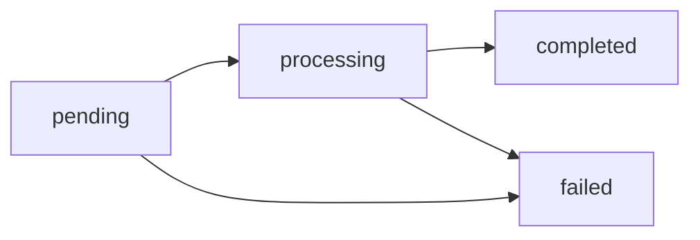

# ffmate: FFmpeg with a REST API, Web UI, Webhooks & Queues

`ffmate` bridges the gap between the raw power of FFmpeg and the need for user-friendly interfaces and robust integration capabilities. While FFmpeg is incredibly versatile, its complex command-line syntax can be daunting. `ffmate` solves this by providing simplified interfaces, ready-to-use presets, a robust queueing system, and advanced features like real-time webhook notifications and automated post-transcoding tasks.

## Key Features

* **User-Friendly Interfaces:** Offers a REST API and a modern web interface for easy interaction with FFmpeg.
* **Ready-to-Use Presets:** Includes a comprehensive set of pre-configured transcoding presets for common use cases, simplifying common tasks.
* **Robust Queueing System:** Manages transcoding tasks with a powerful queue that supports prioritization, grouping, and efficient processing.
  * **Webhook Notifications:** Enables real-time notifications to third-party systems about *all* transcoding events (start, progress, completion, errors), facilitating seamless integration into existing workflows and allowing for automated actions to be triggered based on transcoding status.
  * **Post-Transcoding Tasks:** Allows for the execution of custom scripts *immediately* after transcoding is complete.
* **Output Filename Wildcard Support:** Enables dynamic filename generation using wildcards.

## How to Use

### 1. Start the FFmate Server

Start the server by running the following command in your terminal:

```bash
ffmate server
```

### 2. Submit a New Transcoding Task

To submit a new transcoding task, make a POST request to the following endpoint:

```
POST http://localhost:3000/api/v1/tasks
```

#### Request Body

```json
{
  "command": "-y -i ${INPUT_FILE} ${OUTPUT_FILE}",
  "inputFile": "_footage/1.mov",
  "outputFile": "_footage/1r.mov",
  "priority": 1,
  "name": "Camera Card1"
}
```

- **command:** The command parameter defines the FFmpeg command to be executed. It's important to use `${INPUT_FILE}` and `${OUTPUT_FILE}` as placeholders for the input and output file paths, respectively. FFmate will handle the replacement of the actual file paths.
- **inputFile:** The full file path to the file to be transcoded. Provide the full file path to the file to be transcoded (e.g., `/path/to/input/file.mp4`).
- **outputFile:** The full file path where FFmate should save the transcoded file. Specify the full file path where FFmate should save the transcoded file (e.g., `/path/to/output/file.mp4`).
- **priority:** The priority parameter allows assigning a priority level to the transcoding task. It determines the order in which tasks are processed. There are four options:
  - **LOW (1):** Has the lowest priority. Tasks with this priority will be processed when resources are available.
  - **NORMAL (2):** This is the default priority level assigned to tasks.
  - **HIGH (3):** Use this priority level for important tasks that should be processed before tasks with normal priority.
  - **CRITICAL (4):** This is the highest priority level. Tasks with this priority will be processed immediately and will take precedence over all other tasks.
- **name:** The name parameter is an optional field that can be used to set a name or an identifier for the transcoding task. While it's not mandatory, assigning a name can help you easily identify your tasks if your queue contains many jobs.

### 3. Monitor a Task

To monitor the progress of a transcoding task, make a GET request to the following endpoint:

```
GET http://localhost:3000/api/v1/tasks/{taskId}
```

Replace `{taskId}` with the actual ID of the task you want to monitor. You can get the task ID from the response body of the submit task API call (step 2). The server will respond with the current status (e.g., "queued", "processing", "completed") and progress of the task. You can periodically make requests to this monitoring endpoint to track the progress of your transcoding tasks and take appropriate actions based on their status.

### 4. List All Tasks

To retrieve a list of all the transcoding tasks, make a GET request to the following endpoint:

```
GET http://localhost:3000/api/v1/tasks
```

The server will respond with an array of task objects, each containing information such as the task ID, command, input file, output file, priority, name, status, and progress. Here's an example response:

```json
[
  {
    "id": "e7412589-67f5-4e7b-8ae0-0378107a8bef",
    "command": "-y -i ${INPUT_FILE} ${OUTPUT_FILE}",
    "inputFile": "_footage/1.mov",
    "outputFile": "_footage/1r.mov",
    "priority": 2,
    "name": "Transcoding Task 1",
    "status": "queued",
    "progress": 0
  },
  {
    "id": "a1b2c3d4-e5f6-7g8h-9i0j-1k2l3m4n5o6p",
    "command": "-i ${INPUT_FILE} -vf scale=1280:720 ${OUTPUT_FILE}",
    "inputFile": "_footage/2.mp4",
    "outputFile": "_footage/2_720p.mp4",
    "priority": 3,
    "name": "Transcoding Task 2",
    "status": "processing",
    "progress": 45
  }
]
```

The response provides an overview of all the transcoding tasks in the queue, including their current state and progress. You can use this information to display a task list in your application, monitor the overall progress of the transcoding queue, and take appropriate actions based on the status of each task. Note that the list of tasks returned by this endpoint will include tasks in various states, such as queued, processing, completed, failed, or canceled. Regularly polling this endpoint allows you to keep your application in sync with the actual state of the transcoding queue in FFmate.

### 5. Cancel a Task

To cancel a transcoding task that is currently queued or processing, you can do so by making a PATCH request to the following endpoint:

```
PATCH http://localhost:3000/api/v1/tasks/{taskId}/cancel
```

Replace `{taskId}` with the ID of the task you want to cancel. You can get the task ID from the response body of the submit task API call (step 2) or by retrieving the list of all tasks using the endpoint mentioned in step 4.

For example, if you want to cancel a task with the ID `e7412589-67f5-4e7b-8ae0-0378107a8bef`, you would make the following request:

```
PATCH http://localhost:3000/api/v1/tasks/e7412589-67f5-4e7b-8ae0-0378107a8bef/cancel
```

Upon receiving the cancel request, FFmate will attempt to cancel the specified task. If the task is in the queued state, it will be removed from the queue and marked as canceled. If the task is already being processed, FFmate will send a cancellation signal to the underlying FFmpeg process and try to gracefully stop the transcoding operation. It's important to note that canceling a task may not always be instantaneous, especially if the task is already being processed. FFmate will make its best effort to cancel the task as soon as possible, but there may be a slight delay depending on the progress of the transcoding operation. Also, keep in mind that canceling a task does not guarantee that any partially transcoded files will be removed or cleaned up automatically from the output directory. You may need to handle the cleanup of these files manually.

### 6. Delete a Task

To permanently delete a transcoding task from the system, make a DELETE request to the following endpoint:

```
DELETE http://localhost:3000/api/v1/tasks/{taskId}
```

Replace `{taskId}` with the ID of the task you want to delete. For example:

```
DELETE http://localhost:3000/api/v1/tasks/0d0f5079-e26a-46f5-bb37-6b7be8718410
```

When you send a DELETE request, FFmate will remove the task from the system entirely. This is different from canceling a task, as deletion completely eliminates the task record. Note that:
- If the task is currently processing, it may not be immediately deletable.
- Deleted tasks cannot be recovered.
- The associated input and output files are not automatically deleted by this operation.

## Task Statuses

This section provides a comprehensive overview of how tasks progress through different states and how the queuing system works.

### Status Definitions

Each transcoding task in FFmate goes through specific states that provide visibility into its current processing stage. The following table outlines the statuses a task can have:

| Status      | Description                           | Next Possible States  |
|-------------|---------------------------------------|-----------------------|
| pending     | Task is queued but not yet started    | processing, failed    |
| processing  | Task is currently being processed by FFmpeg | completed, failed |
| completed   | Task has finished successfully        | Final state           |
| failed      | Task failed during processing         | Final state           |

### Task Status Flow Diagram

The following Mermaid diagram visualizes the transitions between different task states, helping you understand how tasks move through the system:



### Queue Management

The FFmate queuing system provides a robust mechanism for managing transcoding tasks with precise control over task execution:

- Tasks are processed in strict priority order (CRITICAL > HIGH > NORMAL > LOW).
- Within the same priority level, tasks are processed in the order they were submitted (FIFO).
- Currently processing tasks cannot be preempted.
- High-priority tasks are queued but wait for the current job to complete before starting.

## Dynamic File and Path Wildcards

FFmate comes out-of-the-box with a comprehensive set of wildcards that allow you to dynamically generate output filenames and paths.

| Pattern                  | Description                                                         | Example Output                     |
|--------------------------|---------------------------------------------------------------------|------------------------------------|
| `${INPUT_FILE}`          | Returns the filename portion of the input file without path         | input.mp4                          |
| `${OUTPUT_FILE}`         | Returns the filename portion of the output file without path        | output.mkv                         |
| `${DATE_YEAR}`           | Returns the current full year in 4-digit format                     | 2024                               |
| `${DATE_SHORTYEAR}`      | Returns the current year in 2-digit format                          | 24                                 |
| `${DATE_MONTH}`          | Returns the current month number (01-12) with leading zero          | 01                                 |
| `${DATE_DAY}`            | Returns the current day of month (01-31) with leading zero            | 15                                 |
| `${DATE_WEEK}`           | Returns the current week number (01-52) with leading zero           | 03                                 |
| `${TIME_HOUR}`           | Returns the current hour in 24-hour format (00-23)                  | 14                                 |
| `${TIME_MINUTE}`         | Returns the current minute (00-59) with leading zero                  | 05                                 |
| `${TIME_SECOND}`         | Returns the current second (00-59) with leading zero                  | 32                                 |
| `${TIMESTAMP_SECONDS}`   | Returns the current Unix timestamp in seconds                        | 1705318712                         |
| `${TIMESTAMP_MILLISECONDS}` | Returns the current Unix timestamp with millisecond precision     | 1705318712123                      |
| `${TIMESTAMP_MICROSECONDS}` | Returns the current Unix timestamp with microsecond precision     | 1705318712123456                   |
| `${TIMESTAMP_NANOSECONDS}`  | Returns the current Unix timestamp with nanosecond precision       | 1705318712123456789                |
| `${OS_NAME}`             | Returns the operating system name where the ffmate server is running | darwin                             |
| `${OS_ARCH}`             | Returns the CPU architecture of the server running ffmate           | arm64                              |
| `${UUID}`                | Returns a randomly generated UUID v4                                 | 550e8400-e29b-41d4-a716-446655440000 |

### Usage Example

You can use these wildcards to dynamically generate unique folder and file names that include timestamps, system details, or random identifiers to prevent naming conflicts and provide contextual information about the transcoding process.

**Example 1:**

- **Output pattern:**  
  ```
  /archives/security/${DATE_YEAR}/${DATE_MONTH}/${OS_NAME}_cam01_${INPUT_FILE}.mkv
  ```
- **Result:**  
  ```
  /archives/security/2024/01/darwin_cam01_input.mp4.mkv
  ```

**Example 2:**

- **Output pattern:**  
  ```
  /processed_audio/podcasts/${DATE_YEAR}/Tech_Talk_Ep${TIMESTAMP_SECONDS}.mp3
  ```
- **Result:**  
  ```
  /processed_audio/podcasts/2024/Tech_Talk_Ep1705318712.mp3
  ```

## Contributing

Thank you for considering contributing to ffmate! A contribution guide will be released in the future.

## License

ffmate is MIT Licensed. Copyright © 2025 by We love media
